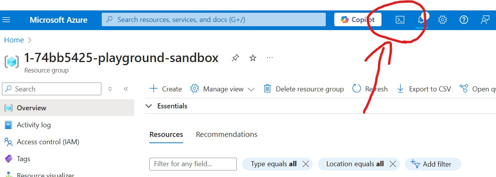

# Scenario Setup

These instructions explain how to setup the scenario for today's exercise.

First you'll need to setup a Pluralsight Cloud Sandbox for Azure (as we have done on previous workshops).

Once the sandbox is setup, login to the Azure portal and navigate to your resource group:



From here you'll want to create a **Bash** Cloud Shell. When the cloud shell is ready it should look something like this:


From here click the **Manage Files** to upload the following scripts:
* `setup_scenario.sh`
* All `*.tf` files in this folder (`main.tf`, `output.tf`, etc.)

You can then create your scenario resources by running:
```
bash ./setup_scenario.sh
```

You'll then be prompted to provide your resource group name and a prefix.

Once the deploy script has finished you should see a number of different resources starting with `order-processing` or `finance-package`.

The command above should list some Terraform outputs including:
* The order processing site URL (you'll want to look at this first)
* Database connection details

If you've got this far then congratulations! You've successfully setup the scenario and can proceed to [the main instructions here](../workshop_instructions.md)